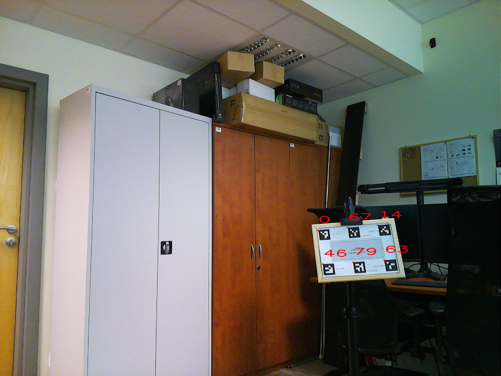
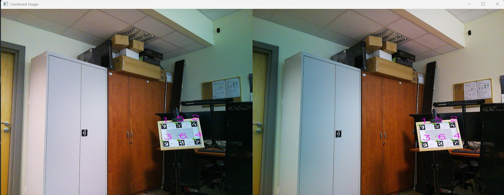
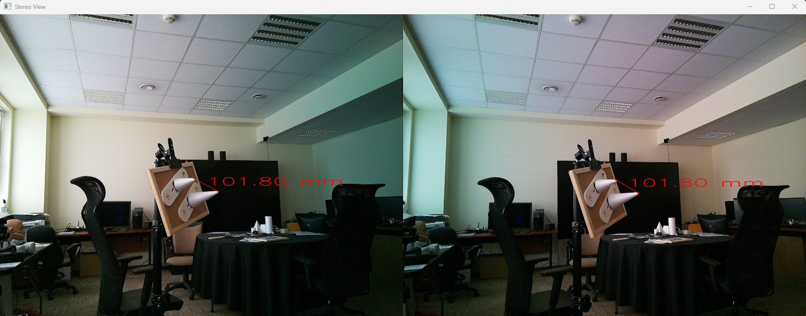

# 📸 Stereokalibracja kamer

## 🎯 Cel ćwiczenia
* uzyskanie macierzy kalibracyjnej stereokamery
* wyznaczenie punktów 3D na podstawie punktów 2D
* wyznaczenie transformacji między ukladami współrzędnych
* wyznaczenie punktów 3d w dwóch układach współrzędnych dla obiektu trójwymiarowego
---

## 📦 Wymagania
Aby uruchomić skrypt, należy mieć zainstalowane wymagane pakiety:

```
pip install -r requirements.txt
```
Wymagane funkcje do dalszych analiz znajdują się w bibliotece
```
lab1_lib_.py
```
🔎 Przed przystapieniem do ćwiczenia warto zapoznać się wstępnie jakie gotowe funkcjonalności są dostępne 


# 📇 Macierze kalibracyjne stereokamery
Kalibracja kamer stereo w OpenCV na podstawie plików JSON z parametrami pojedynczych kamer
Kalibracja kamer stereo pozwala na uzyskanie relacji geometrycznej między dwiema kamerami, co jest kluczowe w aplikacjach takich jak rekonstrukcja 3D czy estymacja głębi. Jeśli masz już pliki JSON zawierające parametry pojedynczych kamer, można je wykorzystać do przeprowadzenia kalibracji stereo.

Funkcja ```calib_stereo_from_jsons()``` przyjmuje jako argument dwa pliki .json z macierzami pojedynczej kalibracji kamery
przykład wywołania funkcji: 

```calib_stereo_from_jsons(matrix_cam_left.json, matrix_cam_right.json```

funkcja zwraca plik .json o strukturze:
```json lines
 jsonStruct = {
        "retS": "ret",
        "K1": "mtxL",
        "D1": "distL",
        "K2": "mtxR",
        "D2": "distR",
        "R": "R",
        "T": "T",
        "E": "E",
        "F": "F",
        "rvecsL": "[r.tolist() for r in rvecsL]",
        "rvecsR": "[r.tolist() for r in rvecsR]",
        "square_size": "square_sizeL"
    }
```
* ***ret***	- Średni błąd reprojekcji (im mniejszy, tym lepiej)
* ***K1, K2*** - Macierze kamer (ogniskowa, punkt główny)
* ***D1, D2*** - Współczynniki dystorsji (radialna, tangencjalna)
* ***R*** - Macierz rotacji opisująca obrót prawej kamery względem lewej. Jeśli kamery są idealnie ustawione równolegle, powinna to być macierz jednostkowa. 
Można ją przekształcić na kąty Eulera, aby określić, jak bardzo kamery są obrócone względem siebie.
* ***T*** - Wektor translacji opisujący przesunięcie prawej kamery względem lewej. Wartość jest wyrażona w tej samej jednostce co objectPoints (zwykle milimetry lub centymetry). Dla poprawnej kalibracji wartość T[0] powinna być bliska rzeczywistej odległości między kamerami.
* ***E*** - Macierz epipolarna (Essential Matrix) opisuje relację geometryczną między punktami w obu obrazach w przestrzeni 3D. Stosowana w przypadku znanej macierzy kamery do obliczeń pozycji punktów 3D.
* ***F*** - Macierz fundamentalna (Fundamental Matrix) Macierz fundamentalna (Fundamental Matrix) opisuje zależności między punktami w dwóch obrazach bez znajomości parametrów kamer. Używana w klasycznych metodach dopasowania stereowizji.

## Wyznaczanie punktów 3D dla markerów ArUco

Dla obrazów z widocznymi markerami ArUco zostaną wykonane dwie operacje
* wykrycie lewego narożnika i zapisanie jego współrzędnych

```
pathL,pathR = r"marker_left.jpg", r"marker_right.jpg"
imageL,imageR = cv2.imread(pathL), cv2.imread(pathR)
imgL, paramsL = aruco_detect_left_corner(imageL)
imgR, paramsR = aruco_detect_left_corner(imageR) # umieść otrzymane obrazy w sprawozdaniu - sprawdź poprawność wyznaczenia naroży
cv2.imwrite("arucoL.jpg",imgL)
cv2.imwrite("arucoR.jpg",imgR)
# ======== instrukcje związane z konfiguracją kamery
...
# =======
# zapis współrzędnych do dalszych analiz
save_marker2json(paramsL,"camL")
save_marker2json(paramsR,"camR")
P_rawL,P_rawR = sortedRawPoints("camL.json","camR.json") # sortowanie punktów dla odpowiadających sobie ID PUNKTY HOMOLOGICZNE
```
### Ważność sortowania punktów po kluczu ID - ```sortedRawPoints```
Ostatnia operacja sortowania punktów po kluczu ID jest kluczowa dla prawidłowej analizy danych. Aby wyniki obliczeń były wiarygodne, zestaw danych musi być uporządkowany. Posiadanie punktów homologicznych 2D oraz odpowiadających im punktów 3D w układzie współrzędnych kamery jest niezbędne do uzyskania poprawnych wyników.

**Porządek punktów:** Jeśli punkty 2D z kamer 1 i 2, a także ich odpowiedniki w przestrzeni 3D, nie będą uporządkowane w ten sam sposób (tj. w tej samej kolejności), proces triangulacji będzie miał trudności z przypisaniem odpowiednich punktów między kamerami. Może to prowadzić do nieprawidłowych wyników, gdzie obliczone punkty 3D nie odpowiadają rzeczywistym pozycjom w przestrzeni.

Kluczowe uwagi:<br>
* Sprawdzanie zgodności punktów: Zawsze przed przystąpieniem do obliczeń należy upewnić się, że punkty homologiczne (2D) są poprawnie sparowane z ich odpowiednikami w przestrzeni 3D. Jest to szczególnie ważne w przypadku dużych zestawów danych, gdzie ręczne sprawdzenie każdego punktu może być trudne. Warto korzystać z odpowiednich narzędzi lub algorytmów, które umożliwiają automatyczne dopasowanie punktów po ID lub innym kluczu.

* Błąd w dopasowaniu punktów: Pominięcie tego kroku sprawi, że triangulacja nie będzie prawidłowa, a uzyskane punkty 3D będą rozmieszczone w sposób niezgodny z rzeczywistością, co negatywnie wpłynie na dalsze analizy i obliczenia.

**Podsumowanie:**<br> 
 **ZAWSZE przed przeprowadzeniem analizy, sprawdź porządek punktów i upewnij się, że punkty 2D i ich odpowiedniki 3D są poprawnie sparowane. To kluczowy krok, który zapewnia poprawność wyników. Przestrzeganie tej zasady zapewnia stabilność i dokładność całego procesu triangulacji oraz dalszych analiz.**

****

Powstały plik .json ma strukturę:


```json lines
{
  "coordinates": [["x1","y1"],["x2","y2"]]
  "ids": ["id_1","id_2"]
}
```

<div align="center">
  
</div>

* Wczytanie parametrów stereo-kalibracji 

```
calibData = calibDataFromFileJson("matrix_cam.json") # wczytanie macierzy kalibracyjnej
points_Camera_3D = get3DpointsFrom2Ddata_full(calibData, P_rawL, P_rawR, type="list") #wyznaczenie punktów 3D w ukłądzie współrzędnych kamery
```
* wyznaczenie punktów 3D rogów w układzie współrzędnych kamery
* 

## Funkcja `points_3d_from_data` - Wyjaśnienie

Funkcja `points_3d_from_data` przekształca dwa zestawy punktów 2D (z lewej i prawej kamery) na współrzędne 3D w przestrzeni. Używa parametrów kalibracyjnych z pliku JSON oraz techniki triangulacji, czyli przecięcia promieni rzutujących z obu kamer.

---

### 1 **Pobranie parametrów kalibracji**
```
K1 = np.array(calib_object["K1"])  # Macierz wewnętrzna kamery 1
D1 = np.array(calib_object["D1"])  # Współczynniki dystorsji kamery 1
K2 = np.array(calib_object["K2"])  # Macierz wewnętrzna kamery 2
D2 = np.array(calib_object["D2"])  # Współczynniki dystorsji kamery 2
R = np.array(calib_object["R"])    # Macierz rotacji między kamerami
T = np.array(calib_object["T"])    # Wektor translacji (przesunięcia) między kamerami
```

### 2. Obliczenie macierzy projekcji P1 i P2
```
def projectionMatrix(mtx1, mtx2, R, T):
    RT1 = np.concatenate([np.eye(3), [[0], [0], [0]]], axis=-1)
    P1 = mtx1 @ RT1  # projection matrix for C1
    RT2 = np.concatenate([R, T], axis=-1)
    P2 = mtx2 @ RT2  # projection matrix for C2
    return P1, P2
```
* P1 to macierz projekcji kamery 1.
* P2 to macierz projekcji kamery 2, uwzględniająca rotację i translację między kamerami.

### 3. Triangulacja punktów 3D `DLT()`

Funkcja DLT (Direct Linear Transformation) służy do triangulacji punktu 3D na podstawie jego rzutów (punktów 2D) na dwóch obrazach uzyskanych z dwóch różnych kamer.
```
def DLT(P1, P2, point1, point2):
    A = [point1[1] * P1[2, :] - P1[1, :],
         P1[0, :] - point1[0] * P1[2, :],
         point2[1] * P2[2, :] - P2[1, :],
         P2[0, :] - point2[0] * P2[2, :]
         ]
    A = np.array(A).reshape((4, 4))
    B = A.transpose() @ A
    U, s, Vh = linalg.svd(B, full_matrices=False)
    return Vh[3, 0:3] / Vh[3, 3]
```

## Finalnie funkcja `points_3d_from_data` zwraca punkty w przestrzeni trójwymiarowej
```
def points_3d_from_data(calibData, listPoints2D_1, listPoints2D_2, type="list"):
    CM1 = calibData["K1"]
    CM2 = calibData["K2"]
    R = calibData["R"]
    T = calibData["T"]
    uvs1, uvs2 = listImgPoints2array(listPoints2D_1, listPoints2D_2)
    P1, P2 = projectionMatrix(CM1, CM2, R, T)
    points3D = getPoints3D(uvs1, uvs2, P1, P2, type=type)
    return points3D
```
### 🔎 Podsumowanie
🔹 *Wejście*:
calib_object: parametry kalibracji (z pliku JSON).

* points2d_1: lista punktów 2D z lewej kamery.

* points2d_2: lista punktów 2D z prawej kamery.

🔹 *Działanie*:
Pobranie parametrów kalibracji (K1, D1, K2, D2, R, T).

* Konwersja punktów 2D na NumPy.

* Obliczenie macierzy projekcji P1 i P2.

* Triangulacja 

* Przekształcenie na współrzędne (x, y, z).

🔹 Wyjście:
* Lista punktów 3D w przestrzeni (np. współrzędne w metrach, jeśli kalibracja jest poprawna).
```
# Wczytanie danych z pliku JSON
with open("calibData.json", "r") as f:
    calib_object = json.load(f)

# Przykładowe punkty z dwóch kamer
points2d_1 = [[100, 200], [150, 250], [300, 400]]
points2d_2 = [[105, 205], [155, 255], [305, 405]]

# Obliczenie współrzędnych 3D
points3D = points_3d_from_data(calib_object, points2d_1, points2d_2)

# Wyświetlenie wyników
print(points3D)
Przykładowy wynik:

[[ 1.2  0.5  3.8]
 [ 1.5  0.6  4.0]
 [ 2.0  1.0  5.2]]
Każdy wiersz [X, Y, Z] to jeden punkt w przestrzeni 3D. 🚀
```
## Wyznaczenie punktów 3D w układzie współrzędnych tablicy

Obiekt testowy z markerami ma określone współrzędne względem siebie i tablicy. Do dalszych analiz wymagane jest zapisanie
tych współrzędnych np. do pliku. Pozwoli to na sprawdzenie poprawności końcowych obliczeń. 
Współrzędne 3D zostały zapisane w milimetrach - są to wartości stałe, na tym etapie proszę ich nie zmieniać. 
```
points = [[9.6,11.5,0],[117.6,11.5,0],[225.6,11.5,0],[9.6,139.5,0],[117.6,139.5,0],[225.6,139.5,0]] #[mm] punkty 3D w układzie współrzędnych tablicy [x,y,0]
ids = [0,67,14,46,79,63] # ID markerów odpowiadające współrzędnym w tablicy points
save_3d_WP(points, ids,"") #zapis punktów 3D w układzie współrzędnych tablicy
l1,l2,points_world_3d = sorted_2d_3d_Points("camL.json","camR.json","3d_world_.json") #sortowanie punktów 2D i 3D po ID
```
## Funkcja `supplementary_data`

Funkcja supplementary_data przetwarza dane kalibracyjne i przestrzenne, aby:

✅ Obliczyć macierze transformacji między układami współrzędnych (światowy ↔ kamera).

✅ Wyznaczyć pozycję i orientację kamer na podstawie punktów referencyjnych.

✅ Obliczyć odległości punktów od kamer.


### 1.  Obliczenie macierzy transformacji
Funkcja wylicza dwie macierze transformacji:

T_WRL2CAM → Transformacja ze świata rzeczywistego (WRL) do układu kamery.

T_CAM2WRL → Transformacja z układu kamery do świata rzeczywistego.
Obie macierze są obliczane za pomocą:
```
T_WRL2CAM = getTransformationMatrix_WRL2CAM(points_world_3d, points_camera_3d)
T_CAM2WRL = getTransformationMatrix_CAM2WRL(points_camera_3d, points_world_3d)
```
Funkcje te przekształcają układ współrzędnych na podstawie znanych punktów 3D w dwóch układach.

### 2. Wczytanie parametrów kamery
Pobierane są macierze K (parametry wewnętrzne) oraz D (zniekształcenia soczewki) dla obu kamer:

```K1 = np.array(calibdata["K1"])
K2 = np.array(calibdata["K2"])
dist1 = np.array(calibdata["D1"])
dist2 = np.array(calibdata["D2"])
```

K1, K2 → Macierze wewnętrzne (parametry kamery).

dist1, dist2 → Współczynniki zniekształceń optycznych.

### 3. Obliczenie pozycji kamer w układzie wizyjnym

Za pomocą calculatePoseCameraInVisinSystem obliczana jest orientacja i pozycja kamer:
```
val, r1, t1, posCAM1_vs, rotCAM1_vs = calculatePoseCameraInVisinSystem(points_camera_3d, p2d_left, K1, dist1)
val, r2, t2, posCAM2_vs, rotCAM2_vs = calculatePoseCameraInVisinSystem(points_camera_3d, p2d_right, K2, dist2)
```
r1, r2 → Wektory obrotu kamer.
t1, t2 → Wektory translacji kamer.

posCAM1_vs, posCAM2_vs → Pozycje kamer w układzie wizyjnym.

rotCAM1_vs, rotCAM2_vs → Orientacje kamer w układzie wizyjnym.

📌 Wyświetlenie orientacji kamer
```
print(f"wektor obrotu kamery lewej {rotCAM1_vs} ")
print(f"wektor obrotu kamery prawej {rotCAM2_vs} ")
```
### 4. Obliczenie odległości punktów od kamer
Za pomocą calculate_distances funkcja oblicza, jak daleko od kamer znajdują się punkty:

```
dCAM1_vs = calculate_distances(posCAM1_vs, points_camera_3d)
dCAM2_vs = calculate_distances(posCAM2_vs, points_camera_3d)
```
📌 Wyświetlenie odległości
```
print(f"odległość punktu od kamery lewej {dCAM1_vs} mm")
print(f"odległość punktu od kamery prawej {dCAM2_vs} mm")
```
📤 Zwracane wartości
```
return T_WRL2CAM, T_CAM2WRL, r1, t1, r2, t2
✅ T_WRL2CAM – Macierz transformacji świat → kamera
✅ T_CAM2WRL – Macierz transformacji kamera → świat
✅ r1, t1 – Rotacja i translacja kamery lewej
✅ r2, t2 – Rotacja i translacja kamery prawej
```

📌 Podsumowanie
🔹 Konwertuje układy współrzędnych (świat ↔ kamera).
🔹 Oblicza pozycję i orientację kamer na podstawie punktów odniesienia.
🔹 Wylicza odległości punktów 3D od kamer.
🔹 Zwraca kluczowe parametry transformacji, które mogą być użyte np. do rekonstrukcji 3D.

To kluczowa funkcja do analizy układu kamer w stereowizji i kalibracji! 🚀

### Funkcja `check_presision`
Funkcja `check_transformation` sprawdza poprawność transformacji 2D-3D oraz 3D-2D, porównując uzyskane wyniki z wartościami oczekiwanymi. Na podstawie danych kalibracyjnych kamery oraz punktów 3D i 2D obliczane są różnice między wartościami obliczonymi a rzeczywistymi.

---
Działanie funkcji:
1. **Wczytywanie danych kalibracyjnych:**

   - Funkcja wczytuje dane kalibracyjne z pliku JSON, które zawierają macierze kamery, dystorsje, rotacje, translacje i macierze transformacji.

    - Wczytane dane są przekształcane na odpowiednie tablice NumPy.

2. **Przygotowanie punktów wejściowych:**

    - Funkcja przyjmuje punkty 3D (object_3d_point) oraz punkty 2D dla lewej i prawej kamery (P_rawL, P_rawR).

    - Przekształca dane wejściowe na tablice NumPy, które będą użyte w dalszych obliczeniach.

3. **Obliczanie punktów 3D z 2D:**

    - Funkcja oblicza punkty 3D w układzie świata na podstawie punktów 2D z kamer oraz danych kalibracyjnych za pomocą funkcji get_3DWorld_from_2DImage.

4. **Obliczanie punktów 2D z 3D:**

    - Funkcja oblicza odwrotność operacji — oblicza punkty 2D na obrazach kamer na podstawie punktów 3D w układzie świata za pomocą funkcji get_2DImage_from_3DWorld.

5. **Porównanie wyników:**

    - Funkcja oblicza różnice pomiędzy rzeczywistymi punktami 3D a wyliczonymi punktami, a także pomiędzy punktami 2D wyliczonymi na podstawie 3D a oryginalnymi punktami 2D.

    - Wyniki są wyświetlane na konsoli w jednostkach milimetrów (dla różnic w przestrzeni 3D) oraz pikselach (dla różnic w przestrzeni 2D).

6. **Wyniki:**
   - Funkcja zwraca różnice między rzeczywistymi a wyliczonymi punktami:

    - Różnice w przestrzeni 3D (w mm):

    **IMG > WRL - różnice między rzeczywistymi punktami 3D a obliczonymi.**

    - Różnice w przestrzeni 2D (w px):

    **WRL > IMG - różnice między punktami 2D obliczonymi na podstawie 3D a rzeczywistymi punktami 2D.**

### 🔎Podsumowanie
Funkcje ```check_precision``` oraz ```supplementary_data``` umożliwiają generowanie danych kalibracyjnych kamer stereo, obliczanie transformacji między układami koordynatów oraz sprawdzanie dokładności transformacji 3D-2D i 2D-3D. Dzięki nim można sprawdzić, czy obliczane punkty w przestrzeni 3D odpowiadają punktom 2D na obrazach kamer, co jest kluczowe przy analizie i weryfikacji wyników kalibracji kamery.

### wizualizacja obliczonych punktów 2D 

Funkcja ```show_data_image``` przedstawia graficzną realizację przekształceń punktów 

<p align="center">
  
</p>


### wizualizacja obliczania odległości między punktami w przestrzeni 

Funkcja ```draw_points_and_distances``` 

* oblicza współrzędne 3D dla dwóch homologicznych punktów na obrazie (każdej z kamer)
* zwraca odległość między punktami w mm

<p align="center">
  
</p>