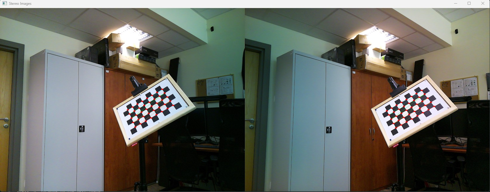

# 📸 Stereokalibracja kamer

## 🎯 Cel ćwiczenia
Celem ćwiczenia jest przechwytywanie zdjęć do **stereokalibracji** oraz wykonanie operacji pośrednich mających na celu:
- Obliczenie **macierzy kamer** na podstawie przechwyconych obrazów.
- Selekcję zdjęć w celu **odfiltrowania tych, które mogą powodować duży błąd kalibracji**.
- Stworzenie folderu z wyselekcjonowanymi obrazami do kalibracji.

---

## 📦 Wymagania
Aby uruchomić skrypt, należy mieć zainstalowane wymagane pakiety:

```
pip install -r requirements.txt
```
Wymagane funkcje do dalszych analiz znajdują się w bibliotece
```
lab1_lib_rpi.py
```
🔎 Przed przystapieniem do ćwiczenia warto zapoznać się wstępnie jakie gotowe funkcjonalności są dostępne 
## Przechwytywanie ramek stereo
Przechwytywanie ramek w trybie live jest obsługiwane przez skrypt ```get_frame.py```

* utworzenie katalogów do zapisu - jeśli nie zostały stworzone wcześniej
Poniższe nazwy katalogów są przykładowe, proszę stworzyć własne nazwy zgodnie ze strukturą 
* Stworzyć swój katalog z nazwą grupy i podgrupy

<!-- START_STRUCTURE -->

# 📂 Wymagana struktura katalogów

- 📁 `WX1S1_xyz`
  - 📁 `kalibracja`
    - 📁 `correct_left`
    - 📁 `correct_right`
    - 📁 `left`
    - 📁 `right`
  - 📄 `matrix_cam_left.json`
  - 📄 `matrix_cam_right.json`
  - 📁 `obiekty`
    - 📁 `obiekt_2d`
      - 📁 `left`
      - 📁 `right`
    - 📁 `obiekt_3d`
      - 📁 `left`
      - 📁 `right`
- 🐍 `01.get_frame.py`
- 🐍 `02.images_checker.py`
- 🐍 `03.calib_err.py`
- 🐍 `lab1_lib_rpi.py`
- 📜 `readme.md`
- 📝 `requirements.txt`
- 

<!-- END_STRUCTURE -->

* w skrypcie ```get_frame.py``` automatycznie zostana stworzone foldery o podanych nazwach. Należy zmienić na swoją nazwę!
```
if not os.path.exists('kalibracja/right'): 
    os.makedirs('kalibracja/right')
if not os.path.exists('kalibracja/left'): 
    os.makedirs('kalibracja/left') 
```
Uruchomienie skryptu uruchomii stereokamere, której podgląd będzie można obserwować w trybie live. Zgodnie z opisaną instrukcją dot. zbierania zdjęć do kalibracjii kamery
należy przechwycić ok. 30 stereo-par. 
dla funkcji ```cv2.imwrite()``` należy podać ścieżkę taką analogiczną jak w utworzonych katalogach

```aiignore
    if key == ord('s'):  # Jeśli naciśniesz 's', zapisuje zdjęcie
        licz+=1
        filename = str(licz).zfill(2)+".jpg"
        resized2 = cv2.resize(frame,(0,0),fx=2,fy=1)
        h1,w1,_ = frame.shape
        left_half = frame[:,:w1//2:]
        right_half = frame[:,w1//2:]
        cv2.imwrite("kalibracja/left/" + filename,left_half)
        cv2.imwrite("kalibracja/right/" + filename,right_half)
```
### Wizualizacja wykrywanych rogów tablicy kalibracyjnej
* do weryfikacji czy tablica oraz jej naroża zostały wykryte służy funkcja ```images_checker(left_img_dir, right_img_dir, save_dir_left, save_dir_right))```
argumentami tej funkcji są ścieżki folderów do zebranych zdjęć oraz do folderów, gdzie będą zapisywane obrazy z poprawnym wykryciem naroży. 
* ⚠️ funkcja ```images_checker()``` umożliwia na monitorowanie czy dla ustalonej
pozycji kamery tablica kalibracyjna jest wykrywana poprawnie. Zdjęcia dla których nie zostaną
wykryte rogi są **<span style="color:orange;">bezużyteczne</span>** do dalszych analiz.

<p align="center">
  
</p>
  
### Kalibracja pojedynczej kamery
Stereo kalibracją jest połączenie dwóch skalibrowanych kamer, w bibliotece znajduje się plik do przeprowadzenia takiej kalibracji. Będzie to niezwykle przydatne dla dalszych obliczeń.
Zachęcam do przeanalizowana kodu, który wykonuje kalibrację kamery.
Na wyjściu funkcji ```calibrate_single_camera()``` powstaje plik json o strukturze:

### Struktura kalibracyjnego pliku JSON

Po kalibracji kamery, plik JSON zawiera dane, które opisują wyniki procesu. Poniżej przedstawiamy przykładową strukturę pliku JSON, który jest zapisywany przez funkcję `camera_calibration2()`.

```json
{
  "images": [
    {
      "filename": "image1.jpg",
      "imagepoints": [["x1", "y1"], ["x2", "y2"], "..."],
      "objectpoints": [["x1", "y1", "z1"], ["x2", "y2", "z2"], "..."]
    },
    {
      "filename": "image2.jpg",
      "imagepoints": [["x1", "y1"], ["x2", "y2"], "..."],
      "objectpoints": [["x1", "y1", "z1"], ["x2", "y2", "z2"], "..."]
    }
  ],
  "ret": 1.0,
  "K": [
    ["fx", 0, "cx"],
    [0, "fy", "cy"],
    [0, 0, 1]
  ],
  "D": ["k1", "k2", "p1", "p2", "k3"],
  "rvecs": [
    ["rx1", "ry1", "rz1"],
    ["rx2", "ry2", "rz2"]
  ],
  "tvecs": [
    ["tx1", "ty1", "tz1"],
    ["tx2", "ty2", "tz2"]
  ],
  "square_size": 25
}
```
### Opis poszczególnych pól:
* ***images***: Lista obiektów zawierających dane o poszczególnych obrazach użytych do kalibracji.

* ***filename***: Nazwa pliku obrazu.

* ***square_size***: Rozmiar pojedynczego pola szachownicy w milimetrach.

* ***imagepoints***: Lista punktów 2D (współrzędne rogów szachownicy) znalezionych na obrazie.

* ***objectpoints***: Lista punktów 3D (współrzędne punktów na szachownicy w przestrzeni realnej).

* ***ret***: Wartość zwrócona przez funkcję cv2.calibrateCamera(), która określa jakość dopasowania (1.0 oznacza perfekcyjne dopasowanie).
****
* ***K***: Macierz kalibracji kamery (wewnętrzne parametry kamery).

* ***fx***, ***fy***: Ogniskowe kamery w pikselach.

* ***cx***, ***cy***: Współrzędne punktu głównego (zwykle środek obrazu).

* ***D***: Współczynniki dystorsji kamery.

* ***k1, k2, p1, p2, k3***: Parametry dystorsji radialnej i tangencjalnej.
****

* ***rvecs***: Lista wektorów rotacji (opisujących orientację kamery względem wzorca).

*<span style="color:yellow;">Każdy wektor zawiera trzy współrzędne (rx, ry, rz) opisujące obrót.</span>*


* ***tvecs***: Lista wektorów translacji (opisujących położenie kamery względem wzorca).

*<span style="color:yellow;">Każdy wektor zawiera trzy współrzędne (tx, ty, tz) opisujące przesunięcie.</span>*


****
# Jak sprawdzić, czy zebrane ramki są odpowiednie - obliczanie błędu reprojekcji?

w ćwiczeniu do określania czy zebrane zdjęcia są odpowiednie, będziemy posługiwać się wartością błędu reprojekcji.
W tym celu należy skorzystać z funkcji
``` img_path, reproj_err = compute_reprojection_errors_from_json(json_calib_file)```
W ten sposób dane są otrzymywane w formacie, który można bezpośrednio wstawić do kolejnej funkcji ⬇️

**Najbardziej czytelną formą interpretacji błędu będzie wykreślenie wykresu słupkowego dla każdego zdjęcia.** W łatwy sposób
można w ten sposób sprawdzić, które zdjęcia znacznie "odstają" od innych. Jakie zdjęcia mają
najmniejsze błędy? Pozwala to na ewentualne dodatkowe przechwycenie ramek, tak wprowadzały
możliwie najmniejszy błąd reprojekcji. Wykres słupkowy można wygerenować korzystjąc z funkcji:
* ```reproj_errors_plot_bar(errors, filenames)``` dla pojedynczej kamery
* ```plot_bar_comparison(imagefiles1, reprojectionerrors1, imagefiles2, reprojectionerrors2)``` dla porównania dwóch kamer 

Przykładowy wykresy
* przed selekcją zdjęć

<p align="center">
  
</p>

* po selekcji zdjęć

<p align="center">
  
</p>

**Wyjaśnienie dla ```reproj_errors_plot_bar(errors, filenames)```:** <br>

**Dane wejściowe:**
* *image_names* to lista nazw zdjęć
* *reprojection_errors:* to lista błędów reprojekcji dla każdego zdjęcia.
* *Obliczanie średniego błędu:* funkcja ```calculate_mean_error(errors)``` oblicza średnią wartość błędów reprojekcji.

**Rysowanie wykresu:**

*Słupki dla błędów reprojekcji są rysowane za pomocą ```go.Bar()```.

*Linia reprezentująca średni błąd jest rysowana za pomocą ```go.Scatter()``` z wartościami równymi średniemu błędowi.

* Aktualizacja wykresu:
```fig.update_layout()``` ustawia tytuł wykresu oraz opisy osi.

**Wywołanie funkcji ```reproj_errors_plot_bar```:**
```
json_file = "matrix_cam_left.json"
image_filenames, reprojection_errors = compute_reprojection_errors_from_json_final(json_file)

fig = reproj_errors_plot_bar(image_filenames, reprojection_errors)
fig.show()
```

Wywołanie funkcji ```plot_bar_comparison()```:
```
json_file1 = "matrix_cam_left.json"
json_file2 = "matrix_cam_right.json"
imagefiles1, reprojectionerrors1 = compute_reprojection_errors_from_json_final(json_file1)
imagefiles2, reprojectionerrors2 = compute_reprojection_errors_from_json_final(json_file2)
fig = plot_bar_comparison(imagefiles1, reprojectionerrors1, imagefiles2, reprojectionerrors2)
fig.show()

```

Można ręcznie selekcjonować zdjęcia, ale lepiej jest zrobić to automatycznie za pomocą wyznaczonego progu wartości błędu.

**<span style="color:green;">W tym celu zachęcam do napisania prostego kodu, który automatycznie wyznaczy tylko te zdjęcia spełniające zdefiniowane wartości progu błędu. 😉</span>** 

# 📊 Co oznacza wynik błędu reprojekcji?
Błąd reprojekcji jest miarą tego, jak dobrze znalezione parametry kalibracji (macierz kamery, dystorsja, rotacja i translacja) odwzorowują rzeczywiste położenie punktów wzorcowych w obrazie.

Wartość błędu reprojekcji mówi, jak daleko średnio znajdują się rzeczywiste punkty obrazu od ich przewidywanych pozycji po przekształceniu modelu kamerowego.

🔹 Jak interpretować wynik?

**<span style="color:green;">Mały błąd (np. < 0.5 pikseli).**


- Bardzo dobra kalibracja.

- Kamera dobrze odwzorowuje rzeczywiste punkty na obrazie.

**<span style="color:orange;">Średni błąd (0.5 - 1 pikseli.)**

- Akceptowalna kalibracja, ale może być niedokładność w parametrach.

- Możliwe przyczyny: szum, niedokładne znalezienie narożników, błędy w detekcji wzorca.

**<span style="color:red;">Duży błąd (> 1 piksel, np. 2-3 piksele i więcej)**

- Słaba jakość kalibracji.

💡 Możliwe przyczyny:

✅ Źle wykryte narożniki szachownicy.<br> 
✅ Złe oznaczenie rzeczywistych rozmiarów wzorca (np. błąd w square_size).<br>
✅ Problemy z ostrością obrazu.<br>
✅ Duża dystorsja soczewki, której model nie opisuje dobrze.

## Ostatnim etapem zbierania danych jest rejestracja obrazów dla lewej i prawej kamery obiektów 2D i 3D.

W tym celu ponownie należy użyć skryptu ```get_frame()``` *<span style="color:red;">ze zmienionymi nazwami katalogów* 
np. punkty_3D - oddzielnie dla prawe i lewej kamery. Przechwycić pare klatek w różnych położeniach obiektów. 
Przykładowe obrazy przedstawiono poniżej

* markery ArUco 
<p align="center">
  
  
</p>

* obiekt 3D

<p align="center">
  
  
</p>


# 🎉 <span style="color:green;">Zadanie z wykorzystaniem Raspberry Pi można uznać za wykonane jeśli:
* zebrane zdjęcia do stereo-kalibracji oraz powstałe macierze kamer, są dobrej jakości na podstawie powyższych kryteriów, 
* Zarejestrowano zdjęcia dla obiektów 3D


